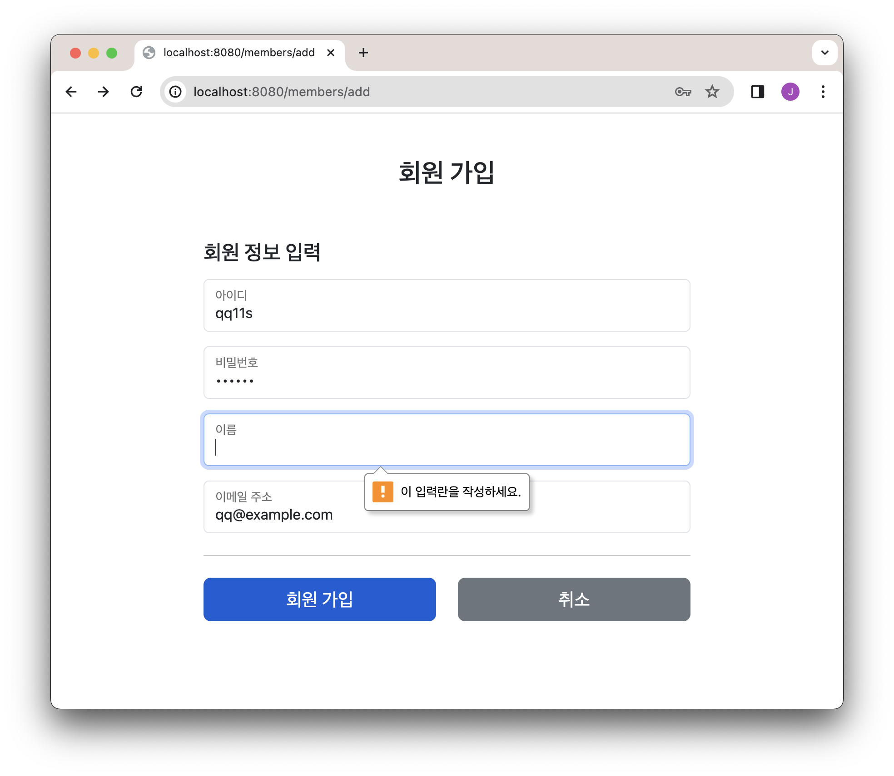

# 【 상품 재고 관리 애플리케이션 】

## ■ 프로젝트 기술
* java
* spring boot, spring framework
* Mybatis (MariaDB)
* Thymeleaf
* javascript

## ■ 요구사항

### 1. 홈화면
* 회원 가입 버튼
* 로그인 버튼

### 2. 회원가입
* 아이디, 비밀번호, 이름, 이메일 주소로 가입

* 유효성 체크
  * 아이디 중복체크
  * 이메일 주소 형식체크 (example@example.com)

### 3. 로그인 화면
* 아이디, 비밀번호 입력

### 4. 로그인 성공
* 로그인한 유저 표시
* 상품관리(리스트) 페이지 버튼 / 로그아웃 버튼

### 5. 상품관리(리스트) 페이지 
* 로그인한 유저만 접근 가능
* 미로그인 상태에서 주소로 접근하면 로그인 화면 표시

* 등록된 상품 리스트 테이블 출력
  * 상품 ID, 상품명, 가격, 수량, 유통기한 출력
  * 상품 ID, 상품명은 누르면 해당 상품의 상세페이지로 이동
* 유통기한에 따른 표시 (범례)
  * 유통기한 7일 이내 : 경고 표시 (red)
  * 유통기한 14일 이내 : 주의 표시 (yellow)
  * 유통기한 경과 : 그레이 아웃

* 검색 버튼 구현
  * 상품명 검색 (부분일치)
  * 가격 제한 검색 (입력 금액 이하 검색)
  * 갯수선택 검색 : 10개 보기, 30개 보기, 50개 보기

* 페이징 구현
  * 처음으로, 끝으로 버튼
  * 최대 10개까지 출력하며 10페이지 이상 존재할 경우 ... 표시
  * 검색과 연동하여 구현

* 상품 등록 버튼

### 6. 상품 등록 화면
* 상품 ID 입력하지 않음
* 상품명, 가격, 수량 입력
* 유통기한 입력 (캘린더 표시)
* 판매 여부 (스위치 버튼)
* 판매 채널 (체크박스)
* 보관 방식 (라디오 버튼)
* 배송 방식 (드롭다운 셀렉트)

* 유효성 체크 
  * 필수 입력 : 상품명, 가격, 수량, 유통기한, 보관방식
  * 가격 : 100~1000000 입력 가능
  * 수량 : 9999 까지 입력 가능
  * 총 최저금액 입력 제한 (가격x수량이 10000 이상만 가능)

* 등록 버튼, 취소 버튼

### 7. 상품 상세 화면
* 상품 관리(리스트) 화면에서 ID 또는 상품명 클릭으로 표시
* 상품 수정, 상품 삭제, 목록으로 버튼 표시
* 해당 상품에 대한 정보를 읽기전용으로 표시

### 8. 상품 삭제
* 상세 화면에서 [상품 삭제]버튼 눌러 삭제

### 9. 상품 수정
* 상품 ID : 수정 불가
* 상품명, 가격, 수량 수정입력 가능
* 유통기한 입력 (캘린더 표시)
* 판매 여부 (스위치 버튼)
* 판매 채널 (체크박스)
* 보관 방식 (라디오 버튼)
* 배송 방식 (드롭다운 셀렉트)

* 유효성 체크
  * 필수 입력 : 상품명, 가격, 수량, 유통기한, 보관방식
  * 가격 : 100~1000000 입력 가능
  * 수량 : 제한 없음
  * 총 최저금액 입력 제한 (가격x수량이 10000 이상만 가능)

* 수정 버튼, 취소 버튼

### 8. 에러 페이지
* 5xx 에러 : 500 에러 페이지 표시
  * [홈 화면으로] 버튼
* 그외 에러 : 404 에러 페이지 표시
  * [홈 화면으로] 버튼

 

## ■ 테이블 내역 ( [테이블 DDL](DDL/table_DDL.sql) )

- MariaDB

 

### 1. item (상품) 테이블

| **컬럼명**         | **타입**      | **조건**                                                     | **내용**                                        |
|:----------------|:------------|:-----------------------------------------------------------|:----------------------------------------------|
| id              | BIGINT      | PK, NOT NULL, auto_increment                               |                                               |
| item_name       | VARCHAR(20) |                                                            |                                               |
| price           | INT         | NOT NULL                                                   |                                               |
| quantity        | INT         | NOT NULL                                                   | 갯수                                            |
| open            | BOOLEAN     | DEFAULT 0                                                  | 0: 판매오픈 , 1: 판매안함                             |
| expiration_date | DATE        | NOT NULL                                                   | uuuu-MM-dd                                    |
| delivery        | VARCHAR(15) |                                                            | FAST, NORMAL, ECONOMIC                        |
| item_type       | VARCHAR(15) | NOT NULL                                                   | ROOM, FRIDGE, FROZEN, ETC                     |
| created_at      | TIMESTAMP   | DEFAULT CURRENT_TIMESTAMP                                  | uuuu-MM-dd HH:mm:ss, KST                      |
| created_user    | VARCHAR(60) |                                                            | 등록 유저명                                        |
| updated_at      | TIMESTAMP   | DEFAULT CURRENT_TIMESTAMP   ON UPDATE CURRENT_TIMESTAMP | uuuu-MM-dd HH:mm:ss, KST                     |
| updated_user    | VARCHAR(60) |                                                            | 업데이트 유저명                                      |
| version         | INT         | NOT NULL DEFAULT 0                                         | 기본값 0, 업데이트시 +1                               |

 

### 2. commercial_channel (판매 채널) 테이블

| **컬럼명**      | **타입**      | **조건**                                                     | **내용**                                            |
|:-------------|:------------|:-----------------------------------------------------------|:--------------------------------------------------|
| id           | BIGINT      | PK, NOT NULL, auto_increment                               |                                                   |
| item_id      | BIGINT      | FK, UK, NOT NULL                                           | Item 테이블 id FK                                    |
| channel_name | VARCHAR(15) | UK                                                         | UK (item_id, channel_name)                        |
| use_yn       | VARCHAR(1)  | NOT NULL DEFAULT '0'                                       | 0: N, 1: Y                                        |
| created_at   | TIMESTAMP   |                                                            | uuuu-MM-dd HH:mm:ss, KST                          |
| created_user | VARCHAR(20) | DEFAULT CURRENT_TIMESTAMP                                  | 등록 유저명                                            |
| updated_at   | TIMESTAMP   |                                                            | uuuu-MM-dd HH:mm:ss, KST |
| updated_user | VARCHAR(20) | DEFAULT CURRENT_TIMESTAMP   ON UPDATE CURRENT_TIMESTAMP | 업데이트 유저명                                          |
| version      | INT(11)     | NOT NULL DEFAULT 0                                         | 기본값 0, 업데이트시 +1                                   |

 

### 3. member (회원) 테이블

| **컬럼명**      | **타입**      | **조건**                                                     | **내용**                   |
|:-------------|:------------|:-----------------------------------------------------------|:-------------------------|
| id           | BIGINT      | PK, NOT NULL, auto_increment                               | auto_increment           |
| login_id     | VARCHAR(30) | UK, NOT NULL                                               |                          |
| password     | VARCHAR(64) | NOT NULL                                                   | sha256 + salt 암호화된 문자열   |
| name         | VARCHAR(60) | NOT NULL                                                   |                          |
| mail_address | VARCHAR(80) | NOT NULL                                                   |                          |
| created_at   | TIMESTAMP   |                                                            | uuuu-MM-dd HH:mm:ss, KST |
| created_user | VARCHAR(20) | DEFAULT CURRENT_TIMESTAMP                                  | 등록 유저명                   |
| updated_at   | TIMESTAMP   |                                                            | uuuu-MM-dd HH:mm:ss, KST |
| updated_user | VARCHAR(20) | DEFAULT CURRENT_TIMESTAMP   ON UPDATE CURRENT_TIMESTAMP | 업데이트 유저명                 |
| version      | INT(11)     | NOT NULL DEFAULT 0                                         | 기본값 0, 업데이트시 +1          |

 

### 4. ERD

</img>

 

## <화면>

##### 1. 홈 화면
</img>

##### 2. 회원 가입 화면
</img>

##### 3. 회원 가입 화면 : 아이디 중복체크
</img>

##### 4. 회원 가입 화면 : 필수 입력 체크
</img>

##### 5. 로그인 화면
</img>

##### 6. 로그인 성공 화면 : 로그인 유저 표시
</img>

##### 7. 상품 목록 화면 (로그인 상태)
미로그인 상태에서 주소로 상품목록화면 접근하면 로그인 화면 표시
</img>

##### 8. 상품 상세 화면 (상품 목록에서 ID 또는 상품명 클릭시 이동)
</img>

##### 9. 상품 등록 화면
</img>

##### 10. 가격제한(1000), 30개 보기 검색
</img>

##### 11. 상품명(item), 50개 보기 검색
</img>

##### 12. 404 에러 표시 (4xx)
</img>

##### 13. 500 에러 표시 (5xx)
</img>
